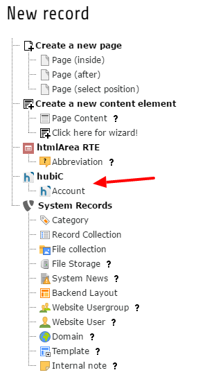
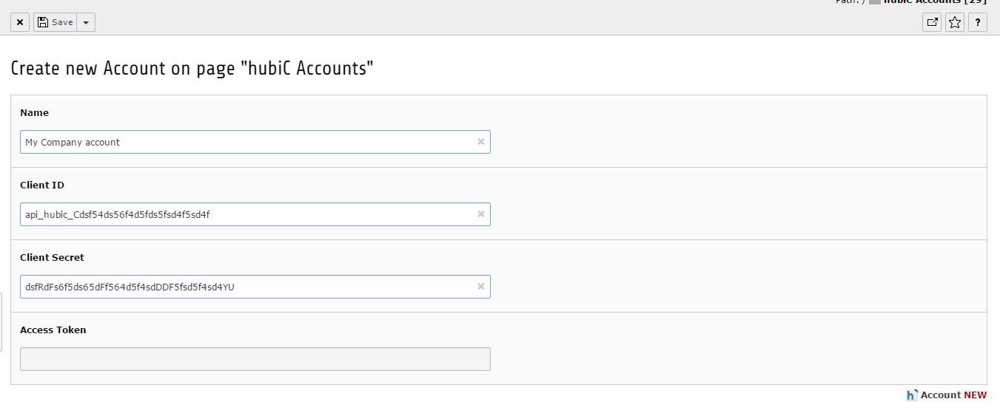
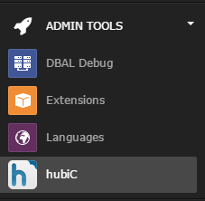
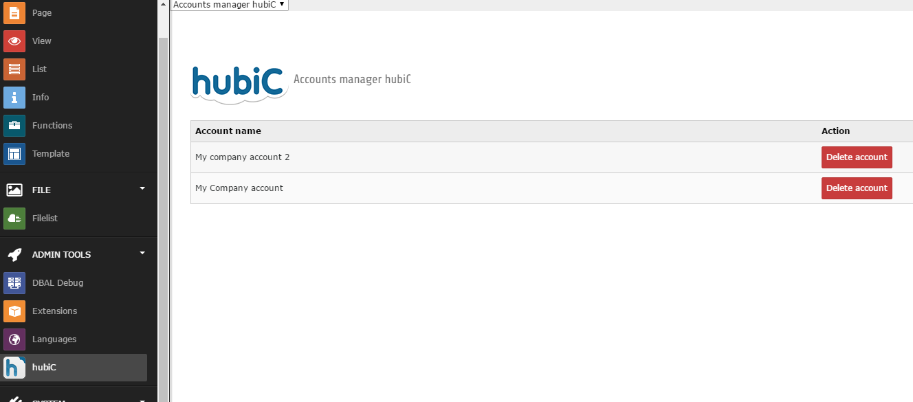
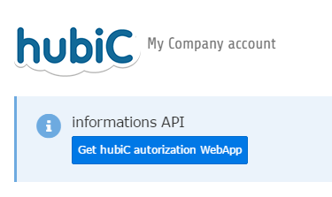
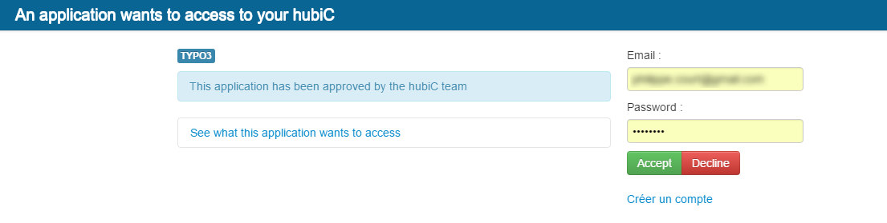
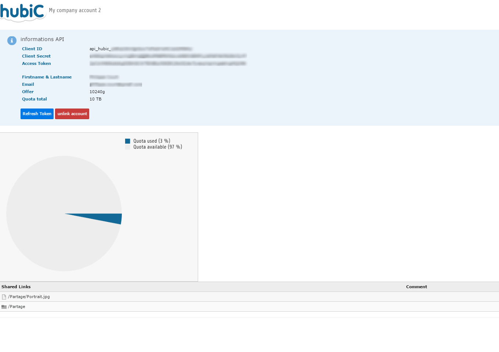
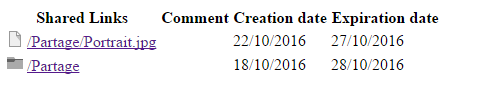

#  shared links for TYPO3

[](https://travis-ci.org/filoucrackeur/hubic) 
[](https://scrutinizer-ci.com/g/filoucrackeur/hubic/?branch=master)
[](https://scrutinizer-ci.com/g/filoucrackeur/hubic/?branch=master) 
[](https://scrutinizer-ci.com/g/filoucrackeur/hubic/build-status/master)
[](https://packagist.org/packages/filoucrackeur/hubic) 
> This extension lets you connect as many hubiC account as you want with TYPO3. You can manage the accounts in a TYPO3 backend module.

>  Join the discussion on Slack in channel [**#ext-hubic**](https://typo3.slack.com/messages/ext-hubic)! – You don't have access to TYPO3 Slack? Get your Slack invitation [by clicking here](https://forger.typo3.org/slack)!

## Configure your hubiC account

First of all go to your [hubic account](https://hubic.com/home/browser/developers/) in developer section.
Add an app with your domain where your TYPO3 is installed. You must give a name and your domain name.

## Installation & Configuration

1. Install with composer (not required)
    ```bash
    composer require filoucrackeur/hubic
    ```
    or
    ```bash
    composer require typo3-ter/hubic
    ```
2. Go in TYPO3 extension Manager and activate "hubic" extension if is not already done
3. Go in the new menu "hubiC" in TYPO3 backend

## How it works
1. First go in your hubiC account [hubiC](https://hubic.com/home/)
2. Go in a page or sysfolder to add an "hubiC > Account"



3. Fill required fields



4. Go in the Admin tools > hubiC module menu



5. Click on the account you want to configure.
 


6. Click on the button to get hubiC authorization WebApp



7. Fill your email and password and click on "Accept"



8. If you success getting token 


9. Click in the account to see details



10. Add plugin in a page to list shared links


11. Go in frontend to view the result



## References

---------------

* [hubiC API](http://api.hubic.com)
* [hubiC docs extension TYPO3](https://typo3.org/extensions/repository/view/hubic)


